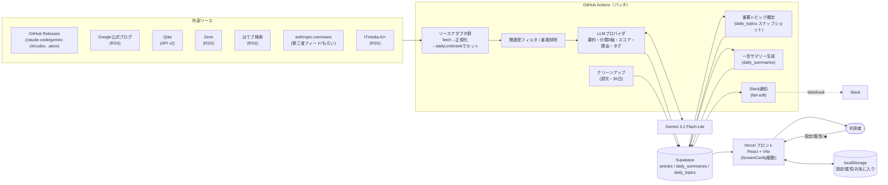
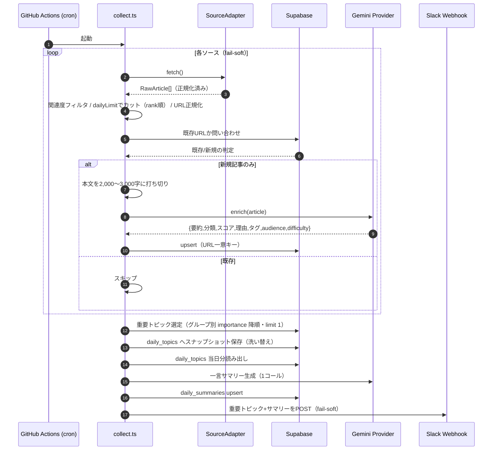
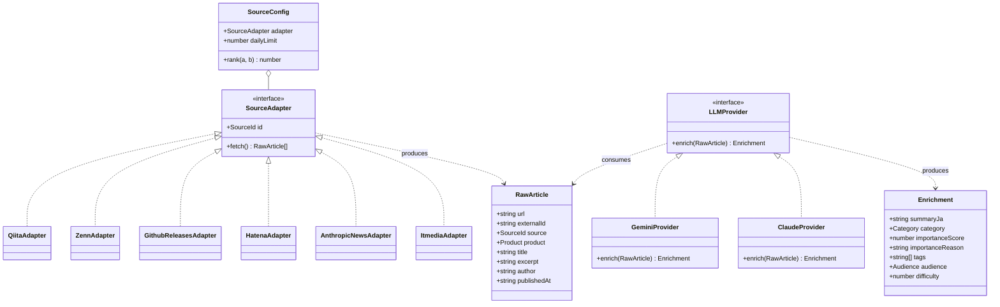

# SPEC.md — 要件定義書

AI Catchup（Claude Code / Gemini / Codex 最新情報アグリゲーター）の仕様の正典。実装判断はこのドキュメントに従う。

---

## 1. 背景と目的

### 1.1 背景
Claude Code / Gemini の最新情報を YouTube や X など複数 SNS を巡回して収集しており、(1) 巡回が非効率、(2) 一次情報は英語が多く翻訳の手間がある、という課題がある。

### 1.2 目的
最新情報を 1 サイトに集約し、**1 日 1 回見るだけでキャッチアップが完了する**状態を作る。英語記事は日本語要約で提示し、翻訳の手間をゼロにする。

### 1.3 設計思想
「全部見せる足し算ツール」ではなく「今日の重要なものだけに絞る引き算ツール」。

---

## 2. スコープ

> 本節は機能拡張完了後（2026-07-10 時点）の確定スコープ。旧 MVP からの変更点は DECISIONS.md の D-024〜D-035 を参照。

### 2.1 含むもの
- 後述の情報源（Claude Code / Gemini / Codex の 3 プロダクト + 業務/経営者向けソース）からの定期収集
- 各記事の日本語要約・分類（category × audience × difficulty の直交 3 軸）・重要度スコア・重要な理由・タグの自動付与（LLM 1 コール）
- ホーム画面 + データ駆動の画面遷移（`ScreenConfig`）。TOP5 とお気に入りは固定枠、残り最大 5 ボタンはユーザーが設定画面で選択する自由枠（合計最大 7 ボタン。D-035）
- 初回訪問時の属性選択ポップアップ（エンジニア初級/中級/上級・バックオフィス・経営者）によるボタン構成のプリセット適用
- お気に入り機能（★ 押下時に記事オブジェクト全体を localStorage にスナップショット保存。永久保有。D-028）
- ホーム画面の一言サマリー（吹き出し。当日の重要トピック（`daily_topics`）から LLM 生成し `daily_summaries` に保存。D-032 / D-038）
- Slack Incoming Webhook による当日 TOP5 + 一言サマリーの通知（1 日 1 投稿）
- 古い記事の自動物理削除（30 日。D-029）
- 自分（+ お試し複数人）専用（本格的な認証は作り込まない）

### 2.2 Non-Goals（作らない）
- X（Twitter）の取得 … 公式 API が高コスト・無料枠が非実用的なため除外
- YouTube の取得 … 将来実装（アダプタ追加で対応可能な設計にはしておく）
- 本格的な多人数向け認証・権限管理（Supabase 匿名認証 + favorites テーブル移行は将来スコープ。D-028）
- コメント・SNS シェア等のソーシャル機能
- モバイルアプリ（Web のみ）

---

## 3. 情報源

全ソースは取得後に共通フォーマット（`RawArticle`）へ正規化する。RSS を持たない/広範すぎるソースには取得後のキーワード関連度フィルタを適用する。
**MVP 分の URL は 2026-06-14、拡張分（#9〜10）は 2026-07-04 に実物確認済み（D-033 / D-034）。**

| # | ソース | 対象 | 取得方法 | エンドポイント（確認済） | 安定性 | 備考 |
|---|---|---|---|---|---|---|
| 1 | GitHub Releases (claude-code) | Claude Code のリリース/変更点 | Atom | `https://github.com/anthropics/claude-code/releases.atom` | ◎ | ✅確認済。一次情報・最優先 |
| 2 | GitHub Releases (gemini-cli) | Gemini CLI のリリース | Atom | `https://github.com/google-gemini/gemini-cli/releases.atom` | ◎ | ✅確認済。**nightly/preview ビルドが多数混入 → 安定版に絞るフィルタ推奨** |
| 3 | Google Developers Blog | Gemini API/製品の公式更新 | RSS | `https://developers.googleblog.com/feeds/posts/default` | ○ | 広範のため要キーワードフィルタ |
| 4 | Google DeepMind Blog | Gemini/モデル発表 | RSS | `https://deepmind.google/blog/rss.xml` | ○ | ✅確認済。AI 全般のため Gemini/Gemma 関連に要キーワードフィルタ |
| 5 | Qiita API v2 | Claude Code/Gemini/Codex 記事 | REST API | `GET https://qiita.com/api/v2/items?query=tag:ClaudeCode`（Gemini は `tag:Gemini`、Codex は `tag:codex`） | ◎ | ✅確認済（slug `claudecode` / `codex`）。認証で 1000 req/h。ストック数を popularity として保持（rank 用） |
| 6 | Zenn | Claude Code/Gemini/Codex 記事 | RSS | `https://zenn.dev/topics/claudecode/feed` / `.../gemini/feed` / `.../codex/feed` | ◎ | ✅確認済（各 slug 明示確認） |
| 7 | はてなブックマーク（キーワード検索） | 注目された関連記事 + 導入事例/ビジネス系 | RSS | `https://b.hatena.ne.jp/q/Claude%20Code?mode=rss&sort=recent`（Claude Code）/ `.../q/AI%20導入?...&target=title&users=1`（導入事例）/ `.../q/生成AI%20ビジネス?...&target=text&users=1`（ビジネス） | ○ | ✅確認済（D-034）。導入事例/ビジネス系は `target` と `users=1` の明示が必須（既定はタグ検索+users=3）。`hatena:bookmarkcount` を popularity として保持 |
| 8 | anthropic.com/news | Anthropic 公式発表 | 第三者スクレイピング由来フィード | `https://raw.githubusercontent.com/Olshansk/rss-feeds/main/feeds/feed_anthropic_news.xml` | △（もろい） | 公式コンテンツだが配信の器が第三者製。運営停止で死ぬ前提。アダプタ抽象化で差し替え可能にしておく |
| 9 | GitHub Releases (openai/codex) | Codex のリリース/変更点 | Atom | `https://github.com/openai/codex/releases.atom` | ◎ | ✅確認済（D-033）。**`rust-vX.Y.Z-alpha.N` 形式の alpha ビルドが多数混入 → `-alpha`/`-beta`/`-rc` 除外フィルタ必須** |
| 10 | ITmedia AI+ | ビジネス/業界動向 | RSS | `https://rss.itmedia.co.jp/rss/2.0/aiplus.xml` | ◎ | ✅確認済（D-033）。全件 AI 関連・元記事 URL 直リンク。PR TIMES は却下（全業種 firehose で絞り込み不能） |

### 3.1 ソース設定値
各ソースには以下を設定として持たせる: `source`（識別子）, `product`（claude_code / gemini / codex / other）, 取得対象のタグ/トピック/検索語, 関連度フィルタの要否。
これらは **TypeScript の登録ファイル `batch/src/sources/index.ts`** に、各アダプタとあわせて `SourceConfig[]` として集約する（拡張子は `.ts`。アダプタ＝関数への参照を持つこと、設定値の型チェックが効くことから JSON ではなく TS を採用）。ソースの追加・削除はこの配列の 1 行の増減で完結させる。

```ts
interface SourceConfig {
  adapter: SourceAdapter;
  dailyLimit: number;                                // enrich に回す上限件数/日
  rank?: (a: RawArticle, b: RawArticle) => number;   // 上限超過時の選抜順。未指定なら publishedAt 降順
}
```

上限管理の単位はアダプタではなく**取得クエリ**（D-031）。クエリ別日次上限の合計は約 280 件/日（Gemini 3.1 Flash-Lite の 500 RPD に対し余白を残す設計。§6.5）。指標のあるソース（Qiita: ストック数、はてブ: ブクマ数）は上限超過時に人気降順で選抜し、それ以外は新着順。カット件数はクエリ別に実行ログへ出力する。

### 3.2 キーワード関連度フィルタ
広範ソース（はてブのテクノロジー全体等を将来追加した場合や、検索語で取り切れない場合）に対し、タイトル/抜粋に対象キーワード（`Claude Code`, `claude-code`, `Gemini`, `gemini-cli` 等）を含むものだけ残す。Qiita のタグ指定や Zenn のトピック指定で十分に絞れるソースには不要。

---

## 4. データフロー

```
[GitHub Actions: collect.yml（cron）]
  1. 各 SourceAdapter.fetch() → RawArticle[]（正規化済み・未要約）
  2. 関連度フィルタ（必要なソースのみ）
  3. クエリ別 dailyLimit で件数カット（rank 指定があれば人気順ソート後にカット。§3.1）
  4. URL 正規化 → DB に既存の URL はスキップ（重複排除）
  5. 新規記事のみ LLMProvider.enrich() → { summaryJa, category, importanceScore, importanceReason, tags, audience, difficulty }
  6. Supabase に upsert（URL 一意キー）
  7. 当日の重要トピック（5 ボタングループ別の最重要 1 件ずつ。§6.4）を確定し、daily_topics へスナップショット保存（D-038）
  8. スナップショットのタイトル+要約から一言サマリーを 1 コール生成し daily_summaries へ upsert
  9. スナップショット + 一言サマリーを Slack Incoming Webhook へ POST（fail-soft。失敗しても collect 全体は継続）

[GitHub Actions: cleanup.yml（週次 cron）]
  10. published_at が 30 日より古い記事を物理削除（is_favorite は参照しない。お気に入りは localStorage 側で独立して永久保有。D-029）。daily_topics の古い行は articles の削除に FK cascade で自動追従

[Vercel: フロント]
  11. 初回訪問時は属性選択ポップアップでボタン構成のプリセットを適用（localStorage）
  12. Supabase を読み、ホーム画面のボタン（ScreenConfig 駆動。固定枠2+自由枠最大5）から各画面へ遷移して表示（重要トピックは daily_topics の最新スナップショットを表示）
  13. ★ でお気に入りをトグル（記事オブジェクト全体を localStorage にスナップショット保存。DB は更新しない）
```

ソース単位で fail-soft（1 ソースの失敗で全体を止めない）。Slack 通知の失敗も fail-soft。

---

## 5. データモデル（Supabase / PostgreSQL）

### 5.1 `articles` テーブル

| カラム | 型 | 制約/既定 | 説明 |
|---|---|---|---|
| `id` | uuid | PK, default gen_random_uuid() | 内部 ID |
| `url` | text | **UNIQUE, NOT NULL** | 正規化後 URL。重複排除キー |
| `source` | text | NOT NULL | ソース識別子 |
| `external_id` | text | nullable | ソースが振った固有 ID（表示/デバッグ/将来用） |
| `product` | text | NOT NULL | `claude_code` / `gemini` / `codex` / `other` |
| `title` | text | NOT NULL | 原題 |
| `excerpt` | text | nullable | 本文/抜粋（要約の入力） |
| `summary_ja` | text | nullable | 日本語要約（LLM 出力） |
| `category` | text | nullable | `update` / `tips` / `business` / `case_study`（LLM 出力） |
| `importance_score` | int | nullable | 1〜10（LLM 出力） |
| `importance_reason` | text | nullable | 重要な理由の短文（10〜15 字。LLM 出力） |
| `tags` | text[] | nullable | トピックタグ 2〜3 個（LLM 出力） |
| `audience` | text | nullable | `engineer` / `backoffice` / `executive`（LLM 出力） |
| `difficulty` | int | nullable | 1〜3（初級/中級/上級。実質エンジニア記事用。LLM 出力） |
| `popularity` | int | nullable | ソース固有の人気指標（Qiita ストック数 / はてブ ブクマ数）。rank 用 |
| `author` | text | nullable | 著者 |
| `published_at` | timestamptz | NOT NULL | 公開日時 |
| `fetched_at` | timestamptz | default now() | 取得日時 |
| `is_favorite` | boolean | default false | **非推奨（D-028）**。お気に入りは localStorage 管理へ移行済み。カラムは残すが cleanup・フロントとも参照しない |
| `llm_provider` | text | nullable | 要約を生成したプロバイダ（デバッグ用） |
| `created_at` | timestamptz | default now() | |
| `updated_at` | timestamptz | default now() | |

拡張フィールド（`importance_reason` / `tags` / `audience` / `difficulty` / `popularity`）は欠損しうる前提。欠損時は null で保存し、欠損値がある軸のフィルタには「対象外」として扱う（`matchesFilter`。既存記事のバックフィルはしない。30 日ローテーションで自然に新形式へ入れ替わる）。

### 5.2 `daily_summaries` テーブル

| カラム | 型 | 制約/既定 | 説明 |
|---|---|---|---|
| `date` | date | PK | JST の日付 |
| `summary_ja` | text | NOT NULL | ホーム吹き出し用の一言サマリー（3 行以内・口語） |
| `created_at` | timestamptz | default now() | |

当日の重要トピック確定後にタイトル+要約から 1 コールで生成し、date で upsert。共通サマリー 1 本のみ（属性別の作り分けはしない。D-032）。Slack 通知の冒頭文にも流用する。

### 5.3 `daily_topics` テーブル（重要トピックのスナップショット。D-038）

| カラム | 型 | 制約/既定 | 説明 |
|---|---|---|---|
| `date` | date | PK（複合） | JST の日付（バッチ実行日） |
| `position` | int | PK（複合） | グループ定義順（0〜4。SETTINGS_GROUPS 順） |
| `group_label` | text | NOT NULL | カード見出し/通知に出すグループ名（例「Claude Code」） |
| `article_id` | uuid | NOT NULL, FK → articles(id) **on delete cascade** | 選定された記事 |
| `created_at` | timestamptz | default now() | |

collect バッチの最終ステップで当日の重要トピック（§6.4）を確定し、当日分を delete → insert で洗い替える。画面・一言サマリー・Slack 通知はすべてこのスナップショットを読む（選定クエリを再実行しない）。記事カラムは FK 埋め込み（PostgREST）で `articles` から取得する。cleanup の 30 日削除には FK cascade で自動追従するため、専用の掃除処理は不要。anon は読み取りのみ許可（RLS）。

### 5.4 インデックス
- `UNIQUE (url)`
- `INDEX (published_at DESC)`
- `INDEX (product, category)`
- `INDEX (importance_score DESC)`

### 5.5 URL 正規化ルール
- スキーム/ホストを小文字化
- 末尾スラッシュの統一
- トラッキングパラメータ（`utm_*`, `fbclid` 等）を除去
- フラグメント（`#...`）を除去

---

## 6. LLM 加工仕様

### 6.1 入出力
入力: `title` + `excerpt`（本文/抜粋）。タイトルだけでなく内容を見て判断する。
- **本文は LLM に渡す前に先頭から一定量で打ち切る（truncate）。上限は 2,000〜3,000 文字を目安**とする。記事は前半に要点が来るため要約はこれで十分で、プロンプトの肥大化・トークン制限超過・コスト/速度悪化を防げる。RSS が短い概要しか返さない場合はそのまま使う。

出力: 厳密な JSON（前後の説明やコードフェンス無し）。

```json
{
  "summary_ja": "日本語 3 行程度の要約",
  "category": "update | tips | business | case_study",
  "importance_score": 1,
  "importance_reason": "重要な理由（10〜15字）",
  "tags": ["タグ1", "タグ2"],
  "audience": "engineer | backoffice | executive",
  "difficulty": 1
}
```

分類は複合ラベルにせず **category × audience × difficulty の直交 3 軸**とする（D-025）。画面のフィルタ条件は全てこの 3 軸 + product の組み合わせで表現する。従来どおり **1 記事 1 コール**（D-006）で全フィールドを取得する。

### 6.2 分類ルール（category）
- `update`: 新機能・リリース・アップデート・仕様変更など、プロダクト自体の変化に関する一次情報的内容。
- `tips`: 使い方・活用術・ハマりどころ・事例など。
- `business`: AI 業界動向・企業の提携/調達・料金/市場ニュースなど、経営層の関心事。
- `case_study`: 企業・組織への AI 導入事例、業務適用レポート（バックオフィス/経営層向け）。
- **判定はタイトルの単語の有無ではなく内容で行う。** 例: タイトルに「最新」が入っていても活用術記事なら `tips`。逆に「`gemini-3-flash` を試した」のような検証/活用記事は、新モデル名を含んでいても `tips` とする（プロダクトのアップデート告知ではないため）。

### 6.3 重要度スコア（importance_score, 1〜10）と重要な理由
内容ベースで重要度を採点。基準はカテゴリ横断で「**読者の行動・判断をどれだけ変えるか**」（D-039）。破壊的変更・メジャーリリースだけでなく、広く役立つ決定版ノウハウや重大な業界ニュース・導入事例も同じ物差しで高く、ニッチな小ネタは低く。**指標（Qiita ストック等）が無いソースも横断評価できる**よう、LLM 判定を主とする。あわせて `importance_reason`（例「破壊的変更」）を 10〜15 字で出力し、カードでスコアと併記する。

### 6.3.1 difficulty の判定基準（1〜3）
| 値 | 基準 |
|---|---|
| 1（初級） | インストール・初期設定・基本コマンド・「はじめてみた」系。前提知識なしで読める |
| 2（中級） | Skill / Subagent / Hooks / MCP 等の機能活用、ワークフロー改善。日常利用者向け |
| 3（上級） | 内部挙動の解析、リリースノートの読み解き、大規模運用・CI 組み込み、複数ツールの組み合わせ |

判定は揺れやすい前提とし、迷ったら低い方に倒す（初級ユーザーに上級記事が混ざるのは軽傷、逆は避ける）。`business` 系は実質 1 固定。

### 6.4 「重要トピック」選定（旧「今日の重要 TOP5」）
**collect バッチの最終ステップで 1 回だけ選定し、結果を `daily_topics` へスナップショット保存する**（D-038）。対象は**バッチ実行時点から遡る直近 24 時間のローリングウィンドウ**（暦日境界ではない。D-023）で、ホームの 5 ボタングループ（Gemini / Claude Code / Codex / バックオフィス / 経営者向け）**それぞれの最重要記事を 1 件ずつ**選ぶ（`importance_score` 降順・グループ別に `limit(1)`。最大 5 件。該当0件のグループは保存しない＝非表示）。**全ユーザー一律**（固定のグループ定義を使い、ユーザーのチェック状態には依存しない。D-036）。グループのフィルタは設定画面のグループ定義（§7.2）と同じ product / audience / category で、difficulty は選定では無視する（未 enrich 記事も対象に含める）。同点時のタイブレークは `published_at` の新しさ（決定的な順序にし、消費者間で結果が揺れないようにする）。

画面・一言サマリー（§5.2）・Slack 通知（§8.4）はこのスナップショットを読むだけで、選定クエリを再実行しない。ウィンドウの起点が消費者ごとにずれて内容が食い違うことを防ぐため（D-038）。画面は最新 date のスナップショットを表示する（バッチ実行前の深夜帯は前日分が表示される）。

### 6.5 採用 LLM とコスト
- 使用モデル: **Gemini 3.1 Flash-Lite（15 RPM / 500 RPD）単独**（D-024。旧 Flash → Flash-Lite フォールバック方式は 2025-12 の無料枠削減により廃止）。
- **日次コール数の設計値**: 収集上限 合計約 280 件/日 + 一言サマリー 1 コール。500 RPD の約 56% に抑え、約 4 割の余白を残す（枠の再削減リスク・リトライ・同日再実行への保険。RPD リセットは太平洋時間 0 時 = JST 16 時）。
- **RPM 制御**: 1 件ごとに約 4 秒間隔を空ける（15 RPM 内。fail-soft とあわせてスループットを制御）。280 件時の実行時間は実測で約 5〜7 分（想定 20 分以内）。
- **初回バックフィル対策**: クエリ別日次上限（§3.1）が兼ねるため、「初回のみ期間を絞る」等の別処理は不要。
- 無料枠はプロンプト/応答がモデル学習に使われうる（地域問わず）。流すのは公開記事なので機密上の問題はないが認識しておく。日本は商用利用可（EU/EEA/UK/スイスの除外地域に非該当）。無料枠の数値・規約は変わりうるため定期的に最新を確認。
- 品質を上げたくなったら `LLM_PROVIDER=claude` で Claude API に差し替え（プロバイダ抽象化により入出力 JSON は不変）。

---

## 7. フロントエンド仕様

### 7.1 画面構成（ScreenConfig によるデータ駆動。D-027 / D-035）
**ホーム画面**から各画面へボタン遷移する構成（タブ切替ではない）。画面は「クエリ定義」（`ScreenConfig`）としてデータ化されており、ハードコードされた固定画面ではない。

```ts
interface ScreenConfig {
  id: string;
  label: string;
  icon: string;
  filter: {
    product?: Product;
    category?: Category[];   // 複数指定可
    audience?: Audience;
    difficulty?: number[];   // 複数指定可
  };
  sort: 'importance' | 'published_at';
}
```

#### 7.1.1 ホーム画面
- ロボットマスコットと、その日の記事を踏まえた一言サマリー（吹き出し表示。`daily_summaries` の当日行。無ければフォールバック文言）を配置する。
- ボタンを配置し、各ボタンが対応する画面へ遷移する入口となる。ボタンはホバーでピル形状に展開する。
- 各画面には「← ホーム」の戻り導線を設け、ホーム画面に戻れるようにする。

#### 7.1.2 ボタン構成: 固定枠 2 + 自由枠最大 5（合計最大 7。D-035）

| 区分 | 画面 | 内容 | 並び順 |
|---|---|---|---|
| 固定 | 重要トピック | バッチが確定した当日スナップショット（`daily_topics` の最新 date。5 ボタングループ別の最重要 1 件ずつ・全ユーザー一律・最大 5 件。§6.4） | グループ定義順（position） |
| 固定 | お気に入り | localStorage に保存した記事全件 | published_at 降順 |
| 自由（最大5） | 設定画面のグループ別チェックから動的生成（下表） | グループ単位で filter を合成 | published_at 降順 |

自由枠は設定画面（§7.2）の 5 グループ（Gemini / Claude Code / Codex / バックオフィス / 経営者向け）単位でボタンが生成される。1 グループ内で複数チェックしても 1 ボタンに統合され、フィルタ条件が配列で合成される（例: Gemini の初級+中級+上級を全てチェック → 「Gemini」ボタン 1 個に全難易度の記事が表示される）。独立した「アップデート」グループは持たず、update 記事は各プロダクトのボタンに難易度別で吸収される（リリースノートの読み解きは上級寄り。§6.3.1）。

### 7.2 設定画面（チェックボックスでボタン構成を選択）

チェック = ホーム画面にボタン表示。TOP5・お気に入りは固定枠でチェック対象外。選択数カウンター「ボタン数 N/5」を表示。

| グループ | 項目 | チェック時に合成されるフィルタ |
|---|---|---|
| Gemini | 初級 / 中級 / 上級 | `product=gemini, audience=engineer, difficulty=[選択した難易度]` |
| Claude Code | 初級 / 中級 / 上級 | `product=claude_code, audience=engineer, difficulty=[選択した難易度]` |
| Codex | 初級 / 中級 / 上級 | `product=codex, audience=engineer, difficulty=[選択した難易度]` |
| バックオフィス | 活用Tips / 導入事例 | `audience=backoffice, category=[tips / case_study の選択分]` |
| 経営者向け | 業界動向 / 導入事例 | `audience=executive, category=[business / case_study の選択分]` |

設定は localStorage に保存する（キー: `aiCatchup.buttonSettings.v1`）。

### 7.3 初回属性選択ポップアップ
- 初回訪問時（localStorage フラグ `aiCatchup.attributeOnboarded.v1` 未設定）にホーム画面表示前へ全画面ポップアップを出す。
- 属性（エンジニア初級/中級/上級・バックオフィス・経営者）を選ぶと、§7.2 のチェックのプリセットが適用される。
- 設定画面からいつでも「属性から選び直す」で再選択できる。

### 7.4 お気に入り（localStorage 管理。D-028）
- ★ 押下時に記事オブジェクト全体を localStorage にスナップショット保存する（キー: `aiCatchup.favorites.v1`）。DB の `is_favorite` は更新しない（非推奨カラム）。
- これにより DB 側で記事が 30 日で物理削除されても、お気に入りの「永久保有」はクライアント側で維持される。
- お気に入り画面は localStorage から直接描画する（全件表示・件数制限なし・DB 問い合わせなし）。

### 7.5 記事カードの表示要素
タイトル / 日本語要約 / ソース名 / 公開日（**日付のみ。時刻は表示しない**） / 元記事リンク（新規タブ） / ★お気に入りトグル / **重要度バッジ**（`重要度 N ｜ 理由` の形式で `importance_reason` を併記） / **タグチップ**（`tags` を 1 行表示。欠損時は非表示）。公開日は `published_at` の日付部分を使う。

- **アコーディオン展開**: カードは同一画面内でアコーディオン展開する。折りたたみ時は要約を 2 行に truncate して表示し、展開時は要約全文と「元記事を開く」ボタンを表示する。
- **プロダクト色帯**: 複数プロダクトが混在する画面では、カード左端にプロダクトごとの色帯を表示する。

### 7.6 空状態の表示
「空 = バグではなく今日は静かだった」と伝わる文言にする。固定枠（TOP5・お気に入り）は専用文言、自由枠は共通文言:

| 画面 | メッセージ |
|---|---|
| TOP5 | 「今日は静かな一日だったみたい」/「大きな動きは無かったよ。また明日チェックしてね」 |
| お気に入り | 「まだお気に入りはありません」/「記事の ★ をタップするとここに保存されます」 |
| 自由枠（共通） | 「このカテゴリは今日は静からしいよ」/「新しい記事が来たらすぐここに並ぶよ」 |

### 7.7 操作
- ★ クリックでお気に入りをトグル（localStorage 更新。§7.4）。
- 元記事リンクは原文へ遷移。

---

## 8. バッチ/インフラ仕様

### 8.1 収集ワークフロー（collect.yml）
- トリガー: `schedule`（1 日 1 回）+ `workflow_dispatch`（手動実行）。
- 頻度変更は cron 式の変更のみ。重複排除（upsert）により頻度を上げても安全。
- 実行時間の実測値: 約 5〜7 分（280 件時想定 20 分以内に収まっている）。
- 最終ステップで重要トピック確定（daily_topics スナップショット保存。§6.4）→ 一言サマリー生成（daily_summaries upsert）→ Slack 通知（§8.4）を実行。いずれも fail-soft。
- 注: GitHub Actions の `schedule` は指定時刻から数分〜十数分遅れて起動しうる（本用途では許容）。

### 8.2 クリーンアップワークフロー（cleanup.yml）
- トリガー: `schedule`（週次）+ `workflow_dispatch`。
- 処理: `published_at < now() - interval '30 days'` を物理削除（`is_favorite` は参照しない。§5.1・D-029）。

### 8.3 シークレット
`SUPABASE_URL`, `SUPABASE_SERVICE_KEY`, `GEMINI_API_KEY`, `QIITA_TOKEN`, `SLACK_WEBHOOK_URL` を GitHub Actions Secrets に格納。リポジトリにコミットしない。

### 8.4 Slack 通知
- collect.yml の最終ステップ（サマリー生成の後）で実行。当日の重要トピック（`daily_topics` スナップショット。§6.4）+ `daily_summaries.summary_ja` を Block Kit 形式で Incoming Webhook へ POST。
- LLM コールなし（既存の `summary_ja` を流用）。
- 記事 0 件の日は「静かだった」旨の本文で投稿。
- fail-soft: 通知失敗が collect 全体を止めない（ユニットテストで検証済み）。

---

## 9. 拡張性要件（設計で担保すること）

| 拡張シナリオ | 対応方法 | 影響範囲 |
|---|---|---|
| a. 要約品質を上げたい（Gemini → Claude） | `LLM_PROVIDER` 環境変数を変更 | プロバイダ実装の追加のみ。呼び出し側は不変 |
| b. 取得頻度を 1 日 1 回 → 複数回 | collect.yml の cron 式変更 | 設定のみ（重複排除済み） |
| c. 新プロダクト追加（実施済み例: Codex） | ソースアダプタ 1 つ追加 + `SourceConfig[]` に登録 + `product` 値追加 | 既存コード不変。設定画面のグループ 1 つ追加で対応（実績: D-033） |

---

## 10. アーキテクチャ図

Mermaid 記法で記述（GitHub / 多くの Markdown ビューアでそのまま描画される）。

### 10.1 コンポーネント図（全体構成）
システムの登場人物と依存関係の俯瞰。



### 10.2 シーケンス図（収集パイプライン）
`collect.yml` 実行時の時間順の流れ。クエリ別上限カットとサマリー生成・Slack通知を含む。



### 10.3 クラス図（抽象化レイヤー）
拡張性の核となるインターフェースとデータ構造の関係。



---

## 11. 差別化ポイント（汎用 RSS リーダーとの違い）

- **非 RSS ソースの統合**: Qiita API・GitHub Atom を同一画面に混在（汎用リーダーは基本 RSS のみ）。
- **ドメイン特化キュレーション**: Claude Code / Gemini / Codex に限定し、category × audience × difficulty の 3 軸自動分類と重要度 TOP5。
- **日本語ファースト**: 英語記事を最初から日本語要約で提示。
- **属性別パーソナライズ**: エンジニア/バックオフィス/経営者などの属性でホーム画面のボタン構成を最初から絞り込める。
- **引き算の UX**: 「今日の 5 件だけ見れば追いつく」。情報を増やさず減らす方向に最適化。設定画面のボタンも最大 7 個に構造的に制限。

---

## 12. 確定事項サマリ

- ソース: 上記 10 種（X 除外 / YouTube は将来）。登録は `batch/src/sources/index.ts`（`SourceConfig[]`）に集約
- 加工: 1 記事 1 LLM コールで {要約, 分類3軸, スコア, 理由, タグ} を取得。本文は 2,000〜3,000 文字で打ち切り
- LLM: **Gemini 3.1 Flash-Lite 単独**（15 RPM / 500 RPD）。日次収集上限 合計約 280 件 + サマリー 1 コール（枠の約 56%）
- 重複排除: URL 正規化を一意キーに upsert
- 保持: 30 日で物理削除（容量ではなく鮮度基準）。お気に入りは localStorage スナップショットで DB 削除と独立して永久保有
- 画面: ホーム画面（マスコット+ボタン）から ScreenConfig 駆動の画面（固定枠2: TOP5/お気に入り + 自由枠最大5）へ遷移
- パーソナライズ: 初回属性選択ポップアップ + 設定画面のグループ別チェックボックスでボタン構成をカスタマイズ
- 通知: Slack Incoming Webhook で当日 TOP5 + 一言サマリーを 1 日 1 投稿（fail-soft）
- 表示: 公開日は日付のみ（時刻なし）。カードに重要度理由・タグチップを表示
- 基盤: GitHub Actions（収集 + クリーンアップ）、表示は Vercel + Supabase
- 抽象化: ソースアダプタ / LLM プロバイダ / upsert / ScreenConfig を実装
