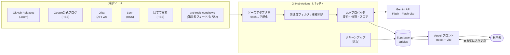
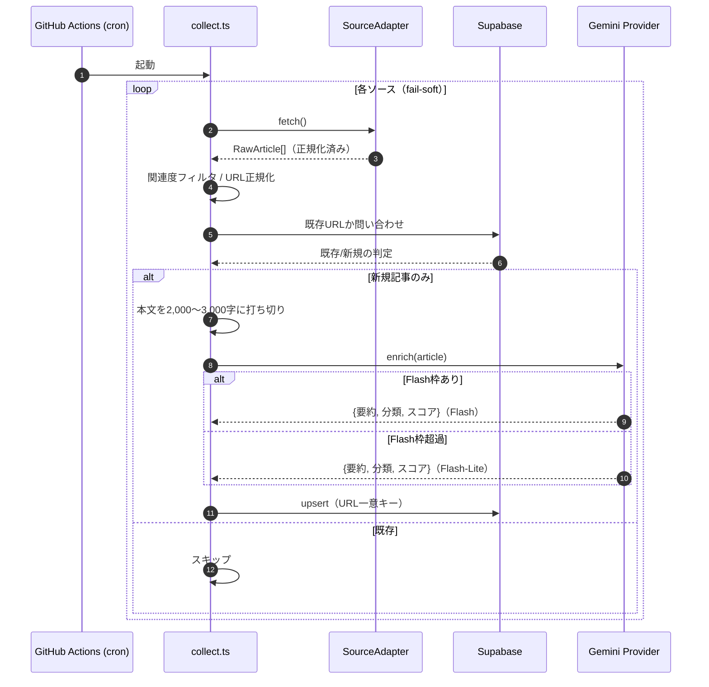
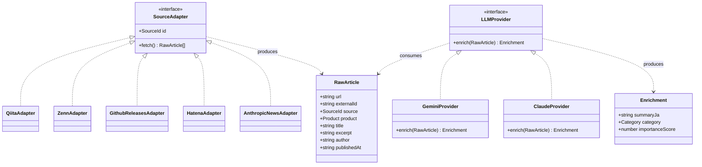

# SPEC.md — 要件定義書

AI Catchup（Claude Code / Gemini 最新情報アグリゲーター）の仕様の正典。実装判断はこのドキュメントに従う。

---

## 1. 背景と目的

### 1.1 背景
Claude Code / Gemini の最新情報を YouTube や X など複数 SNS を巡回して収集しており、(1) 巡回が非効率、(2) 一次情報は英語が多く翻訳の手間がある、という課題がある。

### 1.2 目的
最新情報を 1 サイトに集約し、**1 日 1 回見るだけでキャッチアップが完了する**状態を作る。英語記事は日本語要約で提示し、翻訳の手間をゼロにする。

### 1.3 設計思想
「全部見せる足し算ツール」ではなく「今日の重要なものだけに絞る引き算ツール」。

---

## 2. スコープ

### 2.1 MVP に含む
- 後述の情報源からの定期収集
- 各記事の日本語要約・カテゴリ分類・重要度スコアの自動付与
- ホーム画面 + 5 画面遷移（TOP5 / アップデート / Tips:Claude Code / Tips:Gemini / お気に入り）
- お気に入り機能（永久保有）
- 古い記事の自動物理削除
- 自分専用（本格的な認証は作り込まない）

### 2.2 Non-Goals（MVP では作らない）
- X（Twitter）の取得 … 公式 API が高コスト・無料枠が非実用的なため除外
- YouTube の取得 … 将来実装（アダプタ追加で対応可能な設計にはしておく）
- 多人数向けの認証・権限管理
- コメント・SNS シェア等のソーシャル機能
- モバイルアプリ（Web のみ）

---

## 3. 情報源（MVP）

全ソースは取得後に共通フォーマット（`RawArticle`）へ正規化する。RSS を持たない/広範すぎるソースには取得後のキーワード関連度フィルタを適用する。
**下表の URL は 2026-06-14 に実物確認済み（Google Developers Blog のみ未確定）。**

| # | ソース | 対象 | 取得方法 | エンドポイント（確認済） | 安定性 | 備考 |
|---|---|---|---|---|---|---|
| 1 | GitHub Releases (claude-code) | Claude Code のリリース/変更点 | Atom | `https://github.com/anthropics/claude-code/releases.atom` | ◎ | ✅確認済（最新 v2.1.177 / ほぼ毎日更新）。一次情報・最優先 |
| 2 | GitHub Releases (gemini-cli) | Gemini CLI のリリース | Atom | `https://github.com/google-gemini/gemini-cli/releases.atom` | ◎ | ✅確認済。**nightly/preview ビルドが多数混入 → 安定版に絞るフィルタ推奨** |
| 3 | Google Developers Blog | Gemini API/製品の公式更新 | RSS | `https://developers.googleblog.com/feeds/posts/default`（候補・未確定） | ○ | ⚠️実装時に実物確認。広範のため要キーワードフィルタ |
| 4 | Google DeepMind Blog | Gemini/モデル発表 | RSS | `https://deepmind.google/blog/rss.xml` | ○ | ✅確認済。AI 全般のため Gemini/Gemma 関連に要キーワードフィルタ |
| 5 | Qiita API v2 | Claude Code/Gemini 記事 | REST API | `GET https://qiita.com/api/v2/items?query=tag:ClaudeCode`（Gemini は `tag:Gemini`） | ◎ | ✅確認済（タグ slug `claudecode`）。認証で 1000 req/h |
| 6 | Zenn | Claude Code/Gemini 記事 | RSS | `https://zenn.dev/topics/claudecode/feed` / `https://zenn.dev/topics/gemini/feed` | ◎ | ✅確認済（slug `claudecode` を明示確認）。トピック単位 |
| 7 | はてなブックマーク（キーワード検索） | 注目された関連記事 | RSS | `https://b.hatena.ne.jp/q/Claude%20Code?mode=rss&sort=recent` | ○ | パターン確認済。対象語で絞る |
| 8 | anthropic.com/news | Anthropic 公式発表 | 第三者スクレイピング由来フィード | `https://raw.githubusercontent.com/Olshansk/rss-feeds/main/feeds/feed_anthropic_news.xml` | △（もろい） | ✅live 確認（本日更新・229 件）。**公式コンテンツだが配信の器が第三者製。運営停止で死ぬ前提。アダプタ抽象化で後から RSSHub 自前ホスト/自前スクレイピングに差し替え可能にしておく** |

### 3.1 ソース設定値
各ソースには以下を設定として持たせる: `source`（識別子）, `product`（claude_code / gemini）, 取得対象のタグ/トピック/検索語, 関連度フィルタの要否。
これらは **TypeScript の登録ファイル `batch/src/sources/index.ts`** に、各アダプタとあわせて配列で集約する（拡張子は `.ts`。アダプタ＝関数への参照を持つこと、設定値の型チェックが効くことから JSON ではなく TS を採用）。ソースの追加・削除はこの配列の 1 行の増減で完結させる。

### 3.2 キーワード関連度フィルタ
広範ソース（はてブのテクノロジー全体等を将来追加した場合や、検索語で取り切れない場合）に対し、タイトル/抜粋に対象キーワード（`Claude Code`, `claude-code`, `Gemini`, `gemini-cli` 等）を含むものだけ残す。Qiita のタグ指定や Zenn のトピック指定で十分に絞れるソースには不要。

---

## 4. データフロー

```
[GitHub Actions: collect.yml（cron）]
  1. 各 SourceAdapter.fetch() → RawArticle[]（正規化済み・未要約）
  2. 関連度フィルタ（必要なソースのみ）
  3. URL 正規化 → DB に既存の URL はスキップ（重複排除）
  4. 新規記事のみ LLMProvider.enrich() → { summaryJa, category, importanceScore }
  5. Supabase に upsert（URL 一意キー）

[GitHub Actions: cleanup.yml（週次 cron）]
  6. is_favorite = false かつ published_at が N 日より古い記事を物理削除

[Vercel: フロント]
  7. Supabase を読み、ホーム画面のボタンから各画面（5 画面）へ遷移して表示。★ でお気に入り登録（is_favorite 更新）
```

ソース単位で fail-soft（1 ソースの失敗で全体を止めない）。

---

## 5. データモデル（Supabase / PostgreSQL）

### 5.1 `articles` テーブル

| カラム | 型 | 制約/既定 | 説明 |
|---|---|---|---|
| `id` | uuid | PK, default gen_random_uuid() | 内部 ID |
| `url` | text | **UNIQUE, NOT NULL** | 正規化後 URL。重複排除キー |
| `source` | text | NOT NULL | ソース識別子 |
| `external_id` | text | nullable | ソースが振った固有 ID（表示/デバッグ/将来用） |
| `product` | text | NOT NULL | `claude_code` / `gemini` / `other` |
| `title` | text | NOT NULL | 原題 |
| `excerpt` | text | nullable | 本文/抜粋（要約の入力） |
| `summary_ja` | text | nullable | 日本語要約（LLM 出力） |
| `category` | text | nullable | `update` / `tips`（LLM 出力） |
| `importance_score` | int | nullable | 1〜10（LLM 出力） |
| `author` | text | nullable | 著者 |
| `published_at` | timestamptz | NOT NULL | 公開日時 |
| `fetched_at` | timestamptz | default now() | 取得日時 |
| `is_favorite` | boolean | default false | お気に入り（true は削除対象外） |
| `llm_provider` | text | nullable | 要約を生成したプロバイダ（デバッグ用） |
| `created_at` | timestamptz | default now() | |
| `updated_at` | timestamptz | default now() | |

### 5.2 インデックス
- `UNIQUE (url)`
- `INDEX (published_at DESC)`
- `INDEX (product, category)`
- `INDEX (importance_score DESC)`

### 5.3 URL 正規化ルール
- スキーム/ホストを小文字化
- 末尾スラッシュの統一
- トラッキングパラメータ（`utm_*`, `fbclid` 等）を除去
- フラグメント（`#...`）を除去

---

## 6. LLM 加工仕様

### 6.1 入出力
入力: `title` + `excerpt`（本文/抜粋）。タイトルだけでなく内容を見て判断する。
- **本文は LLM に渡す前に先頭から一定量で打ち切る（truncate）。上限は 2,000〜3,000 文字を目安**とする。記事は前半に要点が来るため要約はこれで十分で、プロンプトの肥大化・トークン制限超過・コスト/速度悪化を防げる。RSS が短い概要しか返さない場合はそのまま使う。

出力: 厳密な JSON（前後の説明やコードフェンス無し）。

```json
{
  "summary_ja": "日本語で 3 行程度の要約",
  "category": "update | tips",
  "importance_score": 1
}
```

### 6.2 分類ルール（category）
- `update`: 新機能・リリース・アップデート・仕様変更など、プロダクト自体の変化に関する一次情報的内容。
- `tips`: 使い方・活用術・ハマりどころ・事例など。
- **判定はタイトルの単語の有無ではなく内容で行う。** 例: タイトルに「最新」が入っていても活用術記事なら `tips`。逆に「`gemini-3-flash` を試した」のような検証/活用記事は、新モデル名を含んでいても `tips` とする（プロダクトのアップデート告知ではないため）。

### 6.3 重要度スコア（importance_score, 1〜10）
内容ベースで重要度を採点。破壊的変更/メジャーアップデート/広く影響する一次情報ほど高く、ニッチな小ネタは低く。**指標（Qiita ストック等）が無いソースも横断評価できる**よう、LLM 判定を主とする。

### 6.4 「今日の重要 TOP5」選定
**直近 24 時間に公開された記事**を `importance_score` 降順で上位 5 件。同点時のタイブレークは、(1) Qiita はストック数、(2) GitHub Releases は新しさ、(3) それ以外は `published_at` の新しさ、の順で補助的に使う。

### 6.5 採用 LLM とコスト
- MVP: Gemini API 無料枠。**主に Flash（10 RPM / 250 RPD）を使う**（品質優先）。
- **フォールバック**: その日の Flash 枠（250）を使い切ったら、同じ Gemini プロバイダ内で **Flash-Lite（15 RPM / 1,000 RPD）に自動切替**。無料枠はモデルごとに別枠のため、合計で 1 日およそ **250 + 1,000 = 1,250 記事**まで処理可能。Flash-Lite は品質が落ちるため、あくまで超過分の受け皿とする。
- **RPM 制御**: Flash は 1 分 10 リクエスト制限のため、バッチ内で 1 件ごとに約 6 秒間隔を空ける（fail-soft とあわせてスループットを制御）。
- **初回バックフィル対策**: 初回実行は過去記事が大量に拾われ 250/日 を超えうる。初回のみ取得期間を直近 N 日に絞る、または初回のみ Flash-Lite で流す。
- 日次想定は重複排除後 20〜50 記事（ピーク 60〜80）。通常運用は Flash のみで収まる。
- 無料枠はプロンプト/応答がモデル学習に使われうる（地域問わず）。流すのは公開記事なので機密上の問題はないが認識しておく。日本は商用利用可（EU/EEA/UK/スイスの除外地域に非該当）。無料枠の数値・規約は変わりうるため本番投入前に最新を確認。
- 品質を上げたくなったら `LLM_PROVIDER=claude` で Claude API に差し替え（プロバイダ抽象化により入出力 JSON は不変）。

---

## 7. フロントエンド仕様

### 7.1 画面構成
**ホーム画面**から各画面へボタン遷移する構成（タブ切替ではない）。

#### 7.1.1 ホーム画面
- ロボットマスコットと、その日の記事を踏まえた一言サマリー（吹き出し表示）を配置する。一言サマリーは LLM 生成（既存の enrich 結果を踏まえて別途生成、または当日記事の集計から組み立てる）。
- 5 つの円形ボタンを配置し、各ボタンが下表の画面へ遷移する入口となる。ボタンはホバーでピル形状に展開する。
- 各画面には「← ホーム」の戻り導線を設け、ホーム画面に戻れるようにする。

#### 7.1.2 遷移先の 5 画面

| 画面 | 内容 | 並び順 |
|---|---|---|
| 今日の重要 TOP5 | 直近 24 時間に公開された全プロダクト横断で重要度上位 5 件 | importance_score 降順 |
| 新機能・アップデート | `category = update` | published_at 降順 |
| Tips（Claude Code） | `product = claude_code` かつ `category = tips` | published_at 降順 |
| Tips（Gemini） | `product = gemini` かつ `category = tips` | published_at 降順 |
| お気に入り | `is_favorite = true` | published_at 降順 |

お気に入りは独立した画面として用意する（ホームから直接遷移）。

### 7.2 記事カードの表示要素
タイトル / 日本語要約 / ソース名 / 公開日（**日付のみ。時刻は表示しない。例「2026/06/14」**） / 元記事リンク（新規タブ） / ★お気に入りトグル / **重要度バッジ（importance_score ≥ 8 の場合のみ表示）**。公開日は `published_at` の日付部分を使う。

- **アコーディオン展開**: カードは同一画面内でアコーディオン展開する（別の詳細画面には遷移しない）。折りたたみ時は要約を 2 行に truncate して表示し、展開時は要約全文（約 300 文字）と「元記事を開く」ボタンを表示する。
- **プロダクト色帯**: 複数プロダクトが混在する画面（TOP5 / アップデート / お気に入り）では、カード左端にプロダクトごとの色帯を表示する（Claude Code: テラコッタ `#D85A30` / Gemini: ブルー `#378ADD`）。単一プロダクトの画面（Tips × 2）では色帯を表示しない。

### 7.3 操作
- ★ クリックで `is_favorite` をトグル（Supabase 更新）。
- 元記事リンクは原文へ遷移。

---

## 8. バッチ/インフラ仕様

### 8.1 収集ワークフロー（collect.yml）
- トリガー: `schedule`（既定 1 日 1 回。例 05:00 JST = `cron: '0 20 * * *'` UTC）+ `workflow_dispatch`（手動実行）。
- 頻度変更は cron 式の変更のみ。重複排除（upsert）により頻度を上げても安全。
- 注: GitHub Actions の `schedule` は指定時刻から数分〜十数分遅れて起動しうる（本用途では許容）。

### 8.2 クリーンアップワークフロー（cleanup.yml）
- トリガー: `schedule`（週次）+ `workflow_dispatch`。
- 処理: `is_favorite = false AND published_at < now() - interval 'N days'` を物理削除。N は既定 30（設定で変更可）。

### 8.3 シークレット
`SUPABASE_URL`, `SUPABASE_SERVICE_KEY`, `GEMINI_API_KEY`, `QIITA_TOKEN` を GitHub Actions Secrets に格納。リポジトリにコミットしない。

---

## 9. 拡張性要件（設計で担保すること）

| 拡張シナリオ | 対応方法 | 影響範囲 |
|---|---|---|
| a. 要約品質を上げたい（Gemini → Claude） | `LLM_PROVIDER` 環境変数を変更 | プロバイダ実装の追加のみ。呼び出し側は不変 |
| b. 取得頻度を 1 日 1 回 → 複数回 | collect.yml の cron 式変更 | 設定のみ（重複排除済み） |
| c. 新プロダクト追加（例: Codex） | ソースアダプタ 1 つ追加 + 設定配列に登録 + `product` 値追加 | 既存コード不変。ホーム画面にボタン 1 つ追加で対応 |

---

## 10. アーキテクチャ図

Mermaid 記法で記述（GitHub / 多くの Markdown ビューアでそのまま描画される）。

### 10.1 コンポーネント図（全体構成）
システムの登場人物と依存関係の俯瞰。



### 10.2 シーケンス図（収集パイプライン）
`collect.yml` 実行時の時間順の流れ。Flash→Flash-Lite フォールバックと重複スキップを含む。



### 10.3 クラス図（抽象化レイヤー）
拡張性の核となるインターフェースとデータ構造の関係。



---

## 11. 差別化ポイント（汎用 RSS リーダーとの違い）

- **非 RSS ソースの統合**: Qiita API・GitHub Atom を同一画面に混在（汎用リーダーは基本 RSS のみ）。
- **ドメイン特化キュレーション**: Claude Code / Gemini に限定し、update/tips の自動分類と重要度 TOP5。
- **日本語ファースト**: 英語記事を最初から日本語要約で提示。
- **引き算の UX**: 「今日の 5 件だけ見れば追いつく」。情報を増やさず減らす方向に最適化。

---

## 12. 確定事項サマリ

- ソース: 上記 8 種（X 除外 / YouTube は将来）。登録は `batch/src/sources/index.ts`（.ts）に集約
- 加工: 1 記事 1 LLM コールで {要約, 分類, スコア} を取得。本文は 2,000〜3,000 文字で打ち切り
- LLM: Flash 主（250/日）→ 使い切ったら Flash-Lite（1,000/日）へ自動フォールバック（合計約 1,250/日）
- 重複排除: URL 正規化を一意キーに upsert
- 保持: 非お気に入りは 30 日で物理削除（容量ではなく鮮度基準）、お気に入りは永久
- 画面: ホーム画面（マスコット+ボタン）から 5 画面（TOP5/アップデート/Tips×2/お気に入り）へ遷移
- 表示: 公開日は日付のみ（時刻なし）
- 基盤: GitHub Actions（収集 + クリーンアップ）、表示は Vercel + Supabase
- 抽象化: ソースアダプタ / LLM プロバイダ / upsert を MVP から実装
